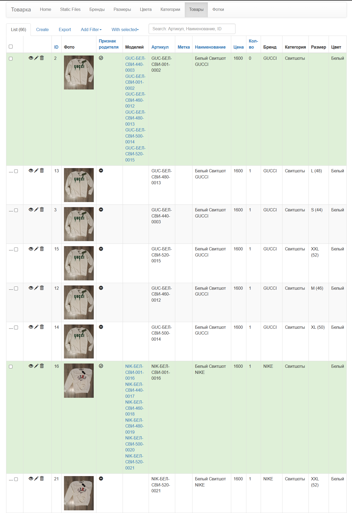

# Web-app for manage product catalog in clothes trading sector

# Entities
- Brands
  - id
  - title
  - products: M2M backref
  - logo
- Sizes
  - id
  - literal
  - numeric
  - products: M2M backref
- Colors
  - id
  - name
  - products: M2M backref
- Categories
  - id
  - title
  - products: M2M backref
- Products
  - id
  - is_parent
  - parent_id
  > **is_parent** and **parent_id** fields are necessary for grouping products by variants
  - sku
  > sku is automatically generated base on:  
  > - **brand**
  > - **color**
  > - **category**
  > - **size**  
  - mark
  - category_id
  - title
  - description
  - text
  - price
  - quantity
  - price_old
  - children: M2M backref
  - images: M2M backref
  - color_id
  - size_id
- Images
  - id
  - path
  - type
  - name

> Files Directory Management View is the feature provided by flask-admin over FTP 

# Features
- **sku** automatically **generating** 
- **products** grouping **by variants**
- **primary image** mechanism
- **export** catalog **in .csv**
- lines **coloring**
- filtering, searching and so on

# Dependencies
- min python 3.11
- min flask 2.*
- sqlalchemy
- postgresql
- flask-admin
- docker
- nginx
- docker-compose
- tasks

> Flask's **circular imports** are awful...sry